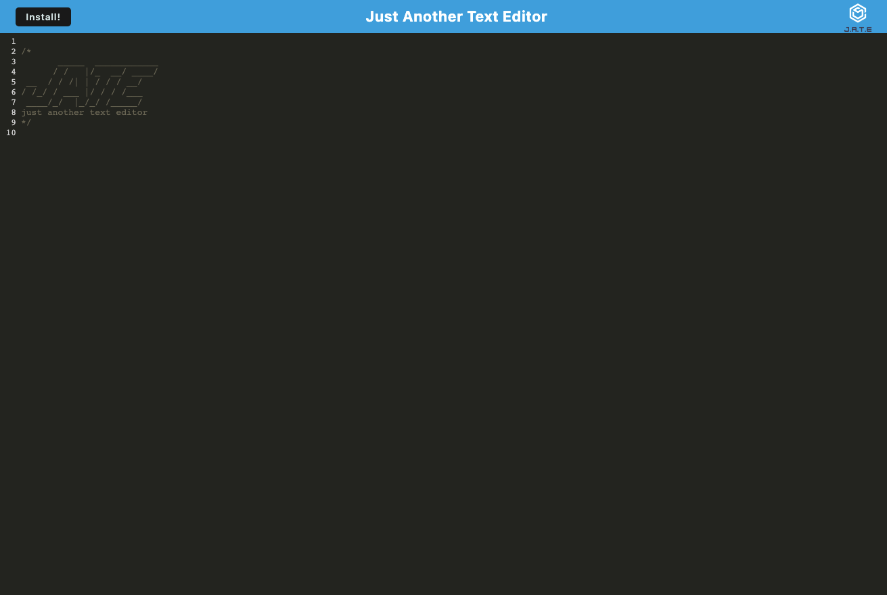

## Text Editor

The purpose of this application is to give the user the ability to use the text editor for whatever purpose they want, both on and offline! Whether thats practiving coding, writing notes, or jotting down blog post ideas.

## Table of Contents 

  * [Instalation](#installation)
  * [Screenshots/Visuals](#screenshots/visuals)
  * [Technology](#technology)
  * [Usage](#usage)
  * [License](#license)
  * [Contributing](#contributing)
  * [Tests](#tests)
  * [Questions](#questions)
  * [Credits](#credits)
  * [Links](#links)

## Installation 

To view the application all that is needed is the Url. However, you can install this application as a PWA on your device by clicking the download button on the browser. 

## Screenshots/Visuals

## Technology

The technologies used for this application were several webpack plugins including: html-webpack-plugin, webpack-pwa-manifest, and workbox-webpack-plugin. Other technologies used were concurently, and nodemon. The main languages used for this application were Javascript, Html, and CSS.  

## Usage

In order to use this application all you need is the Url! 

## License

[MIT](https://choosealicense.com/licenses/mit/)

## Contributing 

If you would like to contribute please contact the owner of the repo or email to the address located in [Questions](#questions).

## Tests

There is no testing for this applications at this moment.

## Questions 

If you have any questions please email me at gareth.t.flynn@gmail.com

## Credits

[@garethtflynn](https://www.github.com/garethtflynn) 

## Links  

* [Repository](https://github.com/garethtflynn/TextEditor)
* [Deployed Application]()

